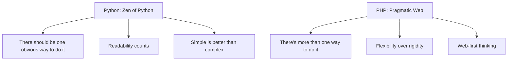

# 🐍➡️🐘 PHP para Pythonistas

> **Uma transição suave do Python para o desenvolvimento web com PHP**

---

## 📋 Índice

- [Introdução](#introdução)
- [Parte 1: Comparação Introdutória](#parte-1-comparação-introdutória)
  - [Contexto e Propósito do PHP](#contexto-e-propósito-do-php)
  - [Diferenças de Paradigma](#principais-diferenças-de-paradigma-e-filosofia)
  - [Comparação Sintática](#comparação-sintática)
- [Parte 2: Exercícios Incrementais](#parte-2-exercícios-incrementais)
- [Próximos Passos](#próximos-passos)
- [Recursos Adicionais](#recursos-adicionais)

---

## 🎯 Introdução

Se você já domina Python, está a poucos passos de conquistar o PHP! Esta apresentação mostrará as principais semelhanças e diferenças entre as linguagens, focando nas "pegadinhas" que podem confundir na transição.

**Objetivo:** Capacitar você a ler, entender e escrever código PHP básico aproveitando seu conhecimento em Python.

### 🤔 Reflexão Inicial
> Qual a principal diferença que você espera encontrar entre uma linguagem criada para propósito geral (Python) e uma focada em web (PHP)?

---

## 📚 Parte 1: Comparação Introdutória

### Contexto e Propósito do PHP

**PHP** (PHP: Hypertext Preprocessor) é uma linguagem de programação interpretada, de tipagem dinâmica, criada originalmente por Rasmus Lerdorf em 1994. Inicialmente desenvolvida como um conjunto de scripts CGI para rastrear visitantes de uma página web, evoluiu para se tornar uma das linguagens mais utilizadas no desenvolvimento web backend.

#### Principais Diferenças Conceituais

| Aspecto | Python | PHP |
|---------|---------|-----|
| **Criação** | 1991 - Propósito geral | 1994 - Específico para web |
| **Filosofia** | "Uma forma óbvia de fazer" | "Múltiplas formas de fazer" |
| **Paradigma** | Multiparadigma desde origem | Procedural → OOP gradualmente |
| **Contexto** | Versatilidade máxima | Otimizado para web |

#### 🌟 Onde PHP Brilha
- **WordPress** - 40% da web usa WordPress
- **Facebook** - Construído em PHP (agora Hack)
- **Wikipedia** - MediaWiki em PHP
- **Laravel, Symfony** - Frameworks modernos e robustos

### Principais Diferenças de Paradigma e Filosofia



**Python** segue o princípio "There should be one obvious way to do it" (Zen of Python), priorizando legibilidade e simplicidade. **PHP**, por outro lado, adota uma abordagem mais pragmática com "There's more than one way to do it", similar ao Perl, oferecendo múltiplas formas de resolver o mesmo problema.

### Comparação Sintática

#### 1. 📢 Print/Echo: Primeira Impressão

A primeira diferença notável para um programador Python é a forma de exibir saída.

**Python:**
```python
print("Olá, mundo!")
print("Meu nome é", "João")
idade = 25
print(f"Tenho {idade} anos")
```

**PHP:**
```php
<?php
echo "Olá, mundo!";
echo "Meu nome é " . "João";
$idade = 25;
echo "Tenho $idade anos";
?>
```

> **🚨 Principais Diferenças:**
> - Ponto-e-vírgula obrigatório
> - Concatenação com `.` em vez de vírgula
> - Interpolação direta de variáveis com `$variavel`
> - Tags PHP `<?php ?>` obrigatórias

#### 2. 📝 Variáveis: O Cifrão que Marca

**Python:**
```python
nome = "Maria"
idade = 30
ativo = True
salario = 2500.50
print(nome, idade, ativo, salario)
```

**PHP:**
```php
<?php
$nome = "Maria";
$idade = 30;
$ativo = true;  // Case insensitive: TRUE, True, true
$salario = 2500.50;
echo "$nome $idade $ativo $salario";
?>
```

> **💡 Vantagens do `$`:**
> - Identificação visual imediata de variáveis
> - Útil em código HTML + PHP misto
> - Herança do Perl para scripting web

#### 3. 🔀 Estruturas Condicionais

**Python (indentação):**
```python
nota = 85

if nota >= 90:
    print("Excelente!")
elif nota >= 70:
    print("Bom trabalho!")
else:
    print("Precisa melhorar")
```

**PHP (chaves):**
```php
<?php
$nota = 85;

if ($nota >= 90) {
    echo "Excelente!";
} elseif ($nota >= 70) {  // Uma palavra!
    echo "Bom trabalho!";
} else {
    echo "Precisa melhorar";
}
?>
```

> **⚠️ Pegadinha:** É `elseif` (uma palavra), não `elif`!

#### 4. 🔄 Estruturas de Repetição

**Python (pythônico):**
```python
# While loop
contador = 1
while contador <= 5:
    print(f"Contador: {contador}")
    contador += 1

# For loop elegante
for i in range(1, 6):
    print(f"Número: {i}")
```

**PHP (estilo C):**
```php
<?php
// While loop
$contador = 1;
while ($contador <= 5) {
    echo "Contador: $contador<br>";
    $contador++;  // Incremento C-style
}

// For loop tradicional
for ($i = 1; $i <= 5; $i++) {
    echo "Número: $i<br>";
}
?>
```

> **🌐 Por que `<br>`?** PHP gera HTML, então precisamos de tags HTML para formatação!

#### 5. ⚙️ Funções: def vs function

**Python:**
```python
def saudacao(nome, idade=18):
    return f"Olá {nome}, você tem {idade} anos"

def calcular_area(largura, altura):
    area = largura * altura
    return area

resultado = saudacao("Ana", 25)
print(resultado)
```

**PHP:**
```php
<?php
function saudacao($nome, $idade = 18) {
    return "Olá $nome, você tem $idade anos";
}

function calcularArea($largura, $altura) {
    $area = $largura * $altura;
    return $area;
}

$resultado = saudacao("Ana", 25);
echo $resultado;
?>
```

> **🔍 Curiosidade:** Nomes de função em PHP são case-insensitive! `minhaFuncao()` = `MINHAFUNCAO()`

#### 6. 📦 Arrays: O Canivete Suíço

**Python (estruturas específicas):**
```python
# Lista
numeros = [1, 2, 3, 4, 5]
print(numeros[0])  # 1

# Dicionário
pessoa = {
    "nome": "Carlos",
    "idade": 28,
    "cidade": "São Paulo"
}
print(pessoa["nome"])  # Carlos
```

**PHP (array unificado):**
```php
<?php
// Array indexado
$numeros = [1, 2, 3, 4, 5];
echo $numeros[0]; // 1

// Array associativo (como dicionário)
$pessoa = [
    "nome" => "Carlos",
    "idade" => 28,
    "cidade" => "São Paulo"
];
echo $pessoa["nome"]; // Carlos

// Flexibilidade: mesmo array com índices mistos!
$misto = [
    0 => "primeiro",
    "chave" => "segundo",
    1 => "terceiro"
];
?>
```

---

## 🧪 Parte 2: Exercícios Incrementais

### 🎯 Exercício 1: Primeiros Passos com Echo

**Objetivo:** Familiarizar-se com a sintaxe básica do PHP.

```php
<?php
// Sua tarefa: Imprima a mensagem "Bem-vindo ao PHP!"
echo "Bem-vindo ao PHP!";
?>
```

**💡 Dica:** Sempre lembre do ponto-e-vírgula e das tags PHP!

---

### 🎯 Exercício 2: Trabalhando com Variáveis

**Objetivo:** Praticar declaração de variáveis e interpolação.

```php
<?php
// Declare variáveis com seu nome, idade e linguagem favorita
$nome = "Seu Nome";
$idade = 25;
$linguagem = "Python";

// Use interpolação ou concatenação
echo "Olá, meu nome é $nome, tenho $idade anos e minha linguagem favorita era $linguagem, mas agora estou aprendendo PHP!";

// Alternativa com concatenação
echo "Olá, meu nome é " . $nome . ", tenho " . $idade . " anos.";
?>
```

---

### 🎯 Exercício 3: Estrutura Condicional

**Objetivo:** Implementar lógica condicional para comparar números.

```php
<?php
$numero1 = 15;
$numero2 = 23;

if ($numero1 > $numero2) {
    echo "$numero1 é maior que $numero2";
} elseif ($numero1 < $numero2) {
    echo "$numero2 é maior que $numero1";
} else {
    echo "Os números são iguais";
}
?>
```

---

### 🎯 Exercício 4: Loop While

**Objetivo:** Usar estrutura de repetição para imprimir uma sequência.

```php
<?php
$contador = 1;
while ($contador <= 5) {
    echo "Número: $contador<br>";
    $contador++;
}
?>
```

---

### 🎯 Exercício 5: Criando Funções

**Objetivo:** Implementar uma função que receba parâmetros e retorne um valor.

```php
<?php
function somar($a, $b) {
    $resultado = $a + $b;
    return $resultado;
}

// Teste a função
$soma = somar(10, 15);
echo "A soma é: $soma";
?>
```

---

### 🏆 Desafio Opcional: Verificador de Maioridade

**Objetivo:** Integrar todos os conceitos aprendidos.

```php
<?php
// Declare variáveis
$nome = "Maria";
$idade = 17;

// Função para verificar maioridade
function verificarMaioridade($idade) {
    if ($idade >= 18) {
        return true;
    } else {
        return false;
    }
}

// Versão mais concisa (bonus)
function ehMaiorDeIdade($idade) {
    return $idade >= 18;
}

// Teste e exiba resultado
$maiorDeIdade = verificarMaioridade($idade);

if ($maiorDeIdade) {
    echo "$nome tem $idade anos e é maior de idade!";
} else {
    echo "$nome tem $idade anos e ainda é menor de idade.";
}
?>
```

**🎯 Desafio Extra:** Como você modificaria este código para processar uma lista de pessoas?

<details>
<summary>💡 Solução do Desafio Extra</summary>

```php
<?php
$pessoas = [
    ["nome" => "Ana", "idade" => 25],
    ["nome" => "João", "idade" => 17],
    ["nome" => "Maria", "idade" => 19]
];

function verificarMaioridade($idade) {
    return $idade >= 18;
}

foreach ($pessoas as $pessoa) {
    $status = verificarMaioridade($pessoa["idade"]) ? "maior" : "menor";
    echo $pessoa["nome"] . " (" . $pessoa["idade"] . " anos) é $status de idade.<br>";
}
?>
```

</details>

---

## 🚀 Próximos Passos

### 🎓 O que você já conquistou:
- ✅ Sintaxe básica do PHP
- ✅ Principais diferenças com Python  
- ✅ Estruturas de controle e funções
- ✅ Arrays e manipulação de dados
- ✅ Primeira aplicação funcional

### 🎯 Próximos Desafios:

#### 📡 **Nível Intermediário**
- **Manipulação de Arrays:** `array_map()`, `array_filter()`, `array_reduce()`
- **Formulários Web:** `$_GET`, `$_POST`, validação de dados
- **Includes e Requires:** Organizando código em múltiplos arquivos

#### 🗄️ **Nível Avançado** 
- **Bancos de Dados:** PDO, MySQL, prepared statements
- **Orientação a Objetos:** Classes, herança, interfaces, namespaces
- **Segurança Web:** SQL injection, XSS, CSRF protection

#### 🏗️ **Nível Profissional**
- **Frameworks:** Laravel (eloquente), Symfony (robusto)
- **APIs RESTful:** Criando e consumindo APIs
- **Testes:** PHPUnit, TDD
- **Deploy:** Docker, CI/CD, performance

### 📚 Recursos Recomendados

#### 📖 Documentação e Tutoriais
- [PHP.net - Documentação Oficial](https://www.php.net/manual/pt_BR/)
- [W3Schools PHP](https://www.w3schools.com/php/)
- [PHP The Right Way](https://phptherightway.com/)

#### 🛠️ Ferramentas de Desenvolvimento
- **XAMPP/WAMP** - Ambiente local completo
- **Composer** - Gerenciador de dependências
- **PHPStorm/VS Code** - IDEs recomendadas

#### 🌐 Frameworks para Explorar
- **Laravel** - O mais popular, elegante e expressivo
- **Symfony** - Robusto, componentes reutilizáveis  
- **CodeIgniter** - Simples e direto

---

## 📊 Resumo Comparativo

| Conceito | Python | PHP | Dificuldade de Transição |
|----------|---------|-----|--------------------------|
| Sintaxe básica | Limpa, indentação | Verbose, chaves | 🟨 Média |
| Variáveis | `nome = "João"` | `$nome = "João";` | 🟩 Fácil |
| Condicionais | `elif` | `elseif` | 🟩 Fácil |
| Loops | `for in range()` | `for($i=0; $i<n; $i++)` | 🟨 Média |
| Funções | `def função():` | `function função() {}` | 🟩 Fácil |
| Arrays | Tipos específicos | Array unificado | 🟨 Média |
| Web Integration | Precisa framework | Nativo | 🟥 Grande vantagem |

---

## 🤝 Contribuições

Este material é open source! Contribuições são bem-vindas:

1. **Fork** este repositório
2. **Crie** uma branch para sua feature (`git checkout -b feature/nova-secao`)
3. **Commit** suas mudanças (`git commit -am 'Adiciona nova seção'`)
4. **Push** para a branch (`git push origin feature/nova-secao`)
5. **Abra** um Pull Request

---

## 📝 Licença

Este projeto está sob a licença MIT. Veja o arquivo [LICENSE](LICENSE) para mais detalhes.

---

## 👨‍💻 Sobre

Criado com ❤️ para facilitar a transição de Pythonistas para o mundo PHP.

**Feito por:** [Seu Nome](https://github.com/seu-usuario)  
**Última atualização:** Agosto 2025

---